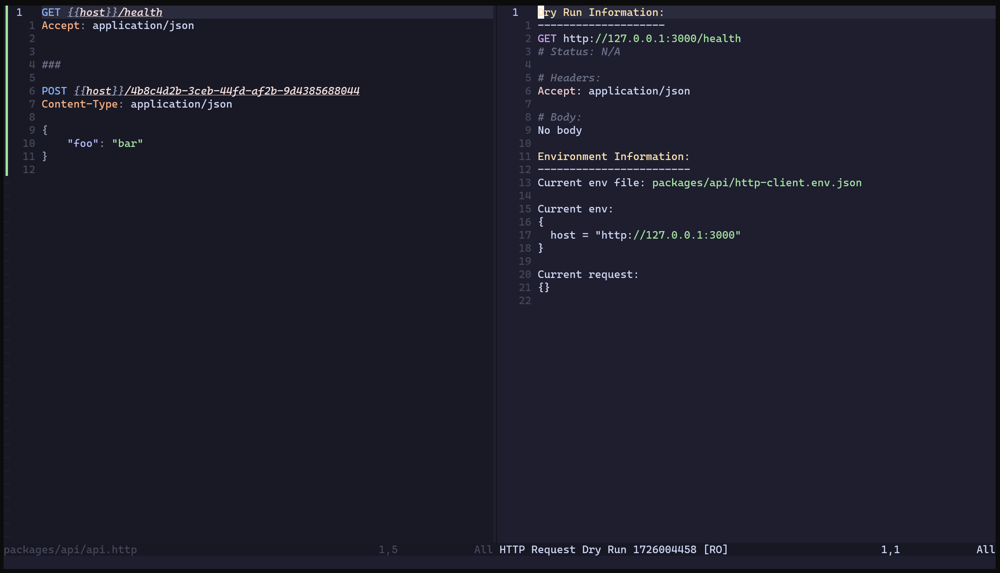
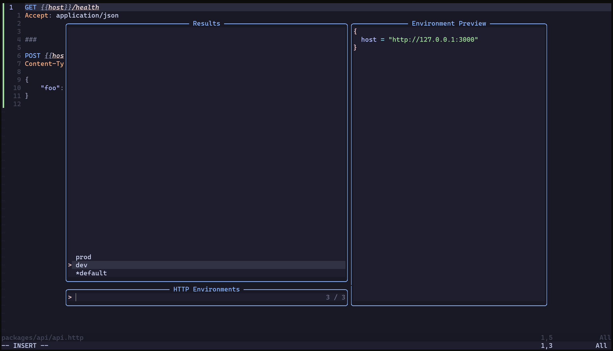
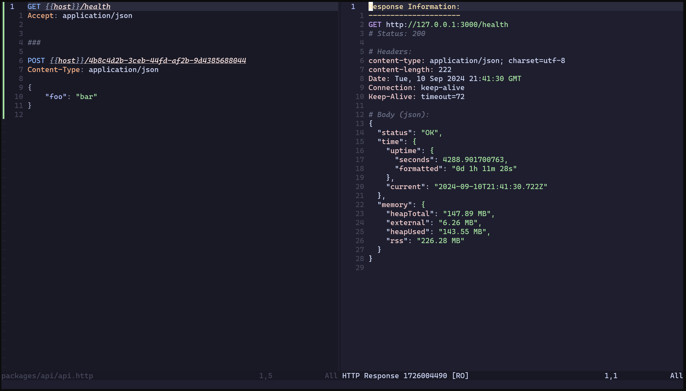

# Neovim HTTP Request Plugin


A Neovim plugin for running HTTP requests directly from .http files, with support for environment variables. Inspired by the IntelliJ HTTP Client, this plugin brings similar functionality to Neovim in an easy-to-install and easy-to-use package.

The core goal is to ensure compatibility with .http files from IntelliJ or VSCode, allowing them to run smoothly in Neovim and vice-versa.

**Development is ongoing, with new features added as needed or when time permits.**

## Table of Contents

- [Features](#features)
- [Installation](#installation)
- [Usage](#usage)
  - [Commands](#commands)
  - [Keybindings](#keybindings)
- [Documentation](#documentation)
- [Screenshots](#screenshots)
- [Contributing](#contributing)
- [License](#license)

## Features

- Run HTTP requests from .http files
- Support for environment variables
- Easy switching between different environments
- Non-blocking requests
- Pretty-printed response display in a separate buffer
- Automatic formatting for JSON and XML responses
- Syntax highlighting for .http files and response buffers
- Verbose mode for debugging
- Dry run capability for request inspection
- Request profiling with detailed timing metrics
- Telescope integration for environment selection
- Autocompletion for HTTP methods, headers and environment variables
- Compatible with [JetBrains HTTP Client](https://www.jetbrains.com/help/idea/http-client-in-product-code-editor.html) and [VSCode Restclient](https://github.com/Huachao/vscode-restclient)

## Installation

This plugin is designed to be installed with [Lazy.nvim](https://github.com/folke/lazy.nvim).

### Quick Start (Copy & Paste)

Copy this complete configuration into your Lazy.nvim setup:

```lua
{
    "heilgar/nvim-http-client",
    dependencies = {
        "nvim-lua/plenary.nvim",
        "hrsh7th/nvim-cmp", -- Optional but recommended for enhanced autocompletion
        "nvim-telescope/telescope.nvim", -- Optional for better environment selection
    },
    event = "VeryLazy",
    ft = { "http", "rest" },
    config = function()
        require("http_client").setup({
            -- Default configuration (works out of the box)
            default_env_file = '.env.json',
            request_timeout = 30000,
            split_direction = "right",
            create_keybindings = true,
            
            -- Profiling (timing metrics for requests)
            profiling = {
                enabled = true,
                show_in_response = true,
                detailed_metrics = true,
            },
            
            -- Default keybindings (can be customized)
            keybindings = {
                select_env_file = "<leader>hf",
                set_env = "<leader>he",
                run_request = "<leader>hr",
                stop_request = "<leader>hx",
                toggle_verbose = "<leader>hv",
                toggle_profiling = "<leader>hp",
                dry_run = "<leader>hd",
                copy_curl = "<leader>hc",
                save_response = "<leader>hs",
            },
        })
        
        -- Set up Telescope integration if available
        if pcall(require, "telescope") then
            require("telescope").load_extension("http_client")
        end
    end
}
```

> **Note about Autocompletion**: If you have nvim-cmp installed, HTTP-specific autocompletion sources are automatically registered and configured for `.http` and `.rest` files. You don't need any additional configuration! The plugin provides completion for HTTP methods, headers, environment variables, and content types out of the box.

For full configuration options, see [Configuration Documentation](doc/configuration.md).

## Usage

1. Create a `.http` file with your HTTP requests.
2. Create a `.env.json` file with your environments.
3. Use the provided commands to select an environment and run requests.

### Commands

- `:HttpEnvFile`: Select an environment file (.env.json) to use
- `:HttpEnv`: Select an environment from the current environment file
- `:HttpRun`: Run the HTTP request under the cursor
- `:HttpRunAll`: Run all HTTP requests in the current file
- `:HttpStop`: Stop the currently running HTTP request
- `:HttpVerbose`: Toggle verbose mode for debugging
- `:HttpProfiling`: Toggle request profiling
- `:HttpDryRun`: Perform a dry run of the request under the cursor
- `:HttpCopyCurl`: Copy the curl command for the HTTP request under the cursor
- `:HttpSaveResponse`: Save the response body to a file

### Keybindings

The plugin comes with the following default keybindings (if `create_keybindings` is set to `true`):

- `<leader>hf`: Select environment file
- `<leader>he`: Set current environment
- `<leader>hr`: Run HTTP request under cursor
- `<leader>hx`: Stop running HTTP request
- `<leader>hv`: Toggle verbose mode
- `<leader>hp`: Toggle request profiling
- `<leader>hd`: Perform dry run
- `<leader>hc`: Copy curl command
- `<leader>hs`: Save response to file

## Documentation

For detailed documentation on specific features, see:

- [Configuration Guide](doc/configuration.md) - Complete configuration options
- [Environment Files and Variables](doc/environments.md) - Working with environments
- [Response Handling](doc/response-handling.md) - Response viewing and handling
- [Request Profiling](doc/profiling.md) - Performance profiling features
- [Telescope Integration](doc/telescope-integration.md) - Using with Telescope
- [Autocompletion](doc/autocompletion.md) - Autocompletion features

You can also access the plugin's help documentation by running `:h http_client` in Neovim.

## Screenshots

### Dry Run

This screenshot shows the dry run feature, which allows you to preview the HTTP request before sending it.

### Environment Selection

This image demonstrates the environment selection within a chosen .env.json file, allowing you to switch between different configurations.

### HTTP Response

This screenshot displays how HTTP responses are presented after executing a request.

## Contributing

Contributions are welcome! Please feel free to submit a Pull Request.

1. Read our [Contributing Guidelines](.github/CONTRIBUTING.md).
2. Ensure you've updated the `CHANGELOG.md` file with your changes.

## License

This project is licensed under the MIT License. See the [LICENSE](LICENSE) file for details.

